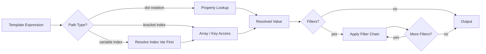
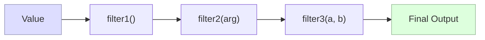



## Overview

The templjs query engine resolves values from structured input data using:

- dot notation for nested properties
- bracket access for array indexes and quoted keys
- built-in filter functions for transformation
- strict/default execution options for missing-path handling

## Query Resolution Flow



## Filter Pipeline



Syntax in templates:

```templ
{{ value | upper | truncate(50) | escape }}
```

Source implementation:
Source implementation: [src/packages/core/src/query-engine/query-engine.ts](../src/packages/core/src/query-engine/query-engine.ts)

Primary behavior tests:
Primary behavior tests: [src/packages/core/test/query-engine/query-engine.test.ts](../src/packages/core/test/query-engine/query-engine.test.ts)

## Dot Notation

Use `.` to walk nested object properties.

```templ
{{ user.profile.name }}
```

With input:

```json
{
  "user": {
    "profile": {
      "name": "Alice"
    }
  }
}
```

Result:

```text
Alice
```

## Array Access

Use bracket notation for numeric indexes.

```templ
{{ items[1] }}
```

```json
{
  "items": ["zero", "one", "two"]
}
```

Result:

```text
one
```

## Variable Index Access

Bracket indexes can reference another root variable.

```templ
{{ items[idx] }}
```

```json
{
  "items": ["zero", "one", "two"],
  "idx": 2
}
```

Result:

```text
two
```

Chained bracket access also works:

```templ
{{ matrix[row][col] }}
```

## Quoted Keys

Use quoted brackets for object keys that are not valid identifiers.

```templ
{{ user["display-name"] }}
```

## Missing Paths and Defaults

By default, unresolved paths return `undefined`.

Programmatic callers can provide `defaultValue` or enable `strict` mode through the query engine API.

Implementation reference:
Implementation reference: [src/packages/core/src/query-engine/types.ts](../src/packages/core/src/query-engine/types.ts)

## Filters

Apply filters with pipe syntax.

```templ
{{ user.name | upper }}
{{ total | round(2) }}
{{ tags | join(", ") }}
```

Built-in function catalogs:

- [String functions](./functions/string-functions.md)
- [Number functions](./functions/number-functions.md)
- [Datetime functions](./functions/datetime-functions.md)
- [Array functions](./functions/array-functions.md)
- [Object functions](./functions/object-functions.md)

## Whitespace Control

templjs supports delimiter trim markers to remove formatting-only whitespace around expressions and statements.

Syntax contract:

- `{{- expr }}`: trim whitespace immediately to the left of the expression
- `{{ expr -}}`: trim whitespace immediately to the right of the expression
- `{{- expr -}}`: trim both sides
- `` / `` / ``: same trim behavior for statements

Trim markers are optional. Templates without trim markers keep existing whitespace behavior.

### Examples by Output Format

JSON:

```templ
{
  "items": [
    
    "{{- item -}}",
    
  ]
}
```

Markdown:

```templ
# Release Notes

- {{- entry.title -}}

```

HTML:

```templ
<ul>

  <li>{{- item.name -}}</li>

</ul>
```

### Migration Guidance

- Start by adding trim markers only where output diffs are noisy (blank lines, indentation gaps, trailing separators).
- Keep control structures readable first; apply `` to the outer loop/condition boundaries before trimming every nested expression.
- Prefer `{{- value -}}` when values are punctuation-sensitive (CSV/JSON lists) to avoid accidental spaces around separators.
- Existing templates remain backward-compatible unless trim markers are added explicitly.

## Overloads and Runtime Dispatch

Some filter names are overloaded by runtime category. For example, `reverse` supports both strings and arrays. The query engine selects the appropriate overload by inspecting the input value and argument shape.

Metadata and overload tests:

- [src/packages/core/test/query-engine/query-engine.metadata.test.ts](../src/packages/core/test/query-engine/query-engine.metadata.test.ts)
- [src/packages/core/test/query-engine/query-engine.catalog.test.ts](../src/packages/core/test/query-engine/query-engine.catalog.test.ts)

## Expression-Based Array Filters

Array helpers such as `filter` and `find` support simple expression strings.

Examples:

```templ
{{ scores | filter("> 90") }}
{{ users | find("active == true") }}
{{ items | where("published") }}
```

Supported comparison forms include:

- scalar comparisons such as `> 1`, `<= 10`, `== "ok"`
- field comparisons such as `age >= 18`, `status == "active"`
- truthy property lookup such as `published`

## Limits and Current Behavior

- Maximum nesting depth defaults to `100` in query execution options.
- Malformed bracket syntax may fall back to property lookup behavior rather than throwing.
- `reduce` is registered but currently returns the input array unchanged.
- Datetime formatting/parsing examples can vary by runtime timezone.

## Related Guides

- [Core and CLI API Reference](./api-reference.md)
- [Configuration Guide](./configuration.md)
- [Getting Started](./getting-started.md)


