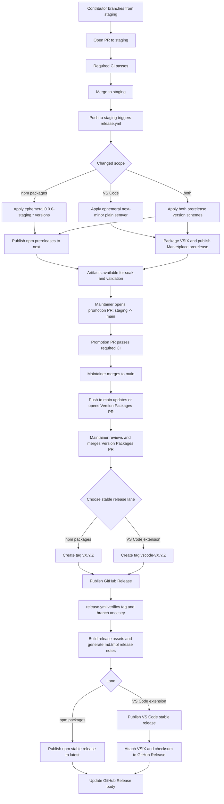

## Release Process

This guide defines the canonical branch strategy and release process for templjs.

Use this document as the source of truth for:

- which branch to target
- how prereleases are published
- how stable releases are promoted and published
- which steps are automated versus manual

## Branch Strategy

templjs uses one stable branch and one long-lived prerelease branch:

- `main`
  - stable integration branch
  - the only branch from which stable releases are cut
  - the only branch where Changesets version PRs are consumed
- `staging`
  - prerelease integration branch
  - the default target for feature, fix, and chore PRs
  - every merge can publish prerelease artifacts automatically, depending on scope
- short-lived branches
  - `feature/*`
  - `fix/*`
  - `chore/*`
  - branch from `staging` and merge back into `staging`

Optional emergency flow:

- `hotfix/*`
  - branch from `main`
  - merge into `main`
  - back-merge into `staging`

Merge method policy:

- contributor PRs into `staging`: `squash`
- promotion PRs into `main`: `rebase`
- plain `merge` commits are disallowed on long-lived branches because the repo requires linear history

Rationale:

- `staging` uses `squash` so prerelease integration history stays PR-shaped, compact, and easy to bisect
- `main` uses `rebase` so promotion from `staging` preserves the already-curated linear commit sequence without introducing a merge commit

## Version Authority

The repository uses two different version authorities for two different purposes:

- stable release authority:
  - Changesets
  - consumed only on `main`
- prerelease version authority:
  - CI-generated ephemeral versions
  - applied only inside GitHub Actions on `staging`
  - never committed back to the repository

This split keeps prerelease publishing automatic without consuming or mutating the authoritative Changesets state before stable promotion.

## Release Lanes

### Staging Prerelease Lane

Pushes to `staging` can publish prerelease artifacts automatically.

Scope rules:

- npm prereleases publish when the merged diff touches `src/packages/**`
- VS Code prereleases publish when the merged diff touches:
  - `src/extensions/vscode/**`
  - `src/packages/core/**`
  - `src/packages/volar/**`
  - `src/packages/context-graph/**`

Versioning rules:

- npm packages use an ephemeral synchronized prerelease version:
  - `0.0.0-staging.<run_number>.<run_attempt>`
- VS Code uses an ephemeral plain semver prerelease line:
  - current stable extension version `X.Y.Z`
  - staging prerelease version `X.(Y+1).N`
  - `N` is derived from the GitHub Actions run number and attempt

Publishing rules:

- npm packages publish to dist-tag `next`
- VS Code publishes with `vsce publish --pre-release`
- no release tags are created for routine staging prereleases
- no manual GitHub Release prerelease checkbox is required for staging prereleases

### Main Stable Lane

Stable releases remain tag-driven from `main`.

Release tags:

- npm packages: `vX.Y.Z`
- VS Code extension: `vscode-vX.Y.Z`

Publishing rules:

- stable publishing starts only after a GitHub Release is published from one of those tags
- package releases publish to npm dist-tag `latest`
- VS Code stable releases publish without `--pre-release`

## Fixed vs Independent Versioning

The release model is split:

- fixed npm train:
  - `@templjs/core`
  - `@templjs/cli`
  - `@templjs/volar`
  - `@templjs/context-graph`
- independent extension:
  - `vscode-templjs`

Changesets configuration lives in [`.changeset/config.json`](../.changeset/config.json).

## End-to-End Flow



## Contributor Workflow

### 1. Branch From `staging`

Create a short-lived branch from `staging`.

### 2. Make Changes

Implement the feature, fix, or chore.

### 3. Add Changesets

If the change affects published packages or the VS Code extension, add a Changeset in the PR:

```bash
pnpm changeset
git add .changeset/
git commit -m "chore: add changeset for feature description"
```

Changesets are still required even though staging prerelease versions are CI-generated, because stable release authority remains on `main`.

### 4. Open PR to `staging`

All normal CI gates must pass before merge.

Contributor PR policy:

- if the PR changes `src/packages/**` or `src/extensions/vscode/**`, it must include at least one `.changeset/*.md` file
- CI enforces this with the `Require Changeset` job
- the automated `main` version PR is exempt from that guard

## Staging Prerelease Workflow

### Automated Steps

After a PR merges to `staging`, `release.yml` automatically:

1. determines whether the merge affects the npm release lane, the VS Code release lane, or both
2. computes CI-only prerelease versions
3. applies those versions in the runner workspace only
4. builds the workspace
5. publishes prerelease artifacts for the affected lane only

### Manual Steps

There are no routine manual publishing steps for staging prereleases.

Maintainers still perform manual validation outside the workflow, for example:

- install npm packages from `next`
- test the VS Code prerelease from Marketplace
- confirm quality, compatibility, and soak behavior

## Promotion Workflow: `staging` to `main`

Promotion is manual and intentional.

### Maintainer Steps

1. Open a PR from `staging` to `main`
2. Confirm the promotion PR passes required CI
3. Apply any release guardrails the team defines for stable promotion
4. Merge the promotion PR into `main`

Current status:

- the same core merge gates apply to `staging` and `main`
- additional promotion guardrails for `main` are a policy layer the team still needs to formalize
- until then, promotion remains a maintainer judgement call backed by prerelease soak results

Recommended future guardrails:

- minimum soak time on `staging`
- benchmark regression threshold
- manual install smoke tests
- release-blocker issue sweep
- maintainer sign-off count higher than ordinary feature PRs

## Stable Release Workflow

### 1. Merge the Version PR on `main`

The `Release` workflow maintains a Changesets-driven "Version Packages" PR on `main`.

That PR:

- applies pending Changesets
- keeps the 4 npm packages aligned
- updates the VS Code extension independently when selected
- regenerates `src/extensions/vscode/CHANGELOG.md` when the extension version changes

### 2. Create the Stable Release Tag

Choose the correct stable lane:

```bash
# npm packages
git tag v0.2.0
git push origin v0.2.0

# VS Code extension
git tag vscode-v0.3.0
git push origin vscode-v0.3.0
```

### 3. Publish a GitHub Release

In GitHub:

- create or publish a release from the stable tag
- do not use the prerelease checkbox for stable releases

### 4. Let Automation Publish the Stable Lane

The workflow then:

- verifies the tag format and selected release lane
- verifies the tagged commit is already reachable from `main`
- verifies the tag version matches the workspace version for that lane
- builds the workspace
- generates GitHub release notes from commit history using `md.tmpl`
- publishes only the selected lane
- updates the GitHub Release body
- attaches VSIX artifacts for extension releases

## Manual Steps Summary

### Recurring Maintainer Steps

- merge PRs into `staging`
- validate prerelease artifacts
- open and merge promotion PRs from `staging` to `main`
- review and merge the `main` version PR
- create stable release tags
- publish stable GitHub Releases

### One-Time / Infrequent Setup Steps

- create and protect `main`
- create and protect `staging`
- configure GitHub environments
- configure npm publishing
- configure VS Code Marketplace publishing
- configure repository secrets

## Required Configuration

### GitHub Branch Protection

Protect both long-lived branches:

- `main`
- `staging`

For both branches:

- require pull requests
- require approvals
- require required CI checks
- require branches to be up to date
- require linear history

### GitHub Environments

Create these environments:

- `prerelease`
  - used by automatic staging publishes
  - usually no manual approval gate
- `release`
  - used by stable publishing from tags
  - optional required reviewers are recommended

### npm

- configure npm trusted publishing for:
  - `@templjs/core`
  - `@templjs/cli`
  - `@templjs/volar`
  - `@templjs/context-graph`
- run `./.github/scripts/prepare-npm-trusted-publishing.sh` to print the exact package URLs and expected trusted publisher values from the repo
- set GitHub repository to `templjs/templ.js`
- set workflow filename to `release.yml`
- leave the npm trusted publisher environment name blank so both staging prereleases and stable releases can publish through the same workflow file
- the remaining manual work is the npm web UI step for each package

### VS Code Marketplace

- set `VSCODE_PUBLISHER_TOKEN`
- ensure the PAT owner can publish under the `templjs` publisher

### Tag Protection

Protect stable tag lanes:

- `v*`
- `vscode-v*`

These protections are for stable releases only. Routine staging prereleases do not use tags.

## Source of Truth

Authoritative release intent comes from:

1. code merged to `staging`
2. Changesets files committed with that code
3. the promotion PR from `staging` to `main`
4. the stable version PR on `main`

Authoritative stable release publication comes from:

- stable tags on `main`
- published GitHub Releases from those tags

Authoritative prerelease publication comes from:

- pushes to `staging`
- CI-computed ephemeral prerelease versions

## Related Docs

- [CI/CD Infrastructure](./ci-cd.md)
- [Repository Structure](./repository-structure.md)
- [Development Guide](../DEVELOPMENT.md)
- [GitHub Actions Workflows](../.github/workflows/README.md)
- [Organization Setup](../.github/organization-setup.md)
- [Secrets Configuration](../.github/SECRETS.md)
